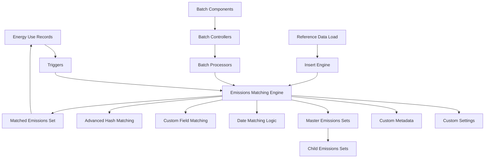

# ⚡ EmissionsMatching

> **A powerful Salesforce accelerator that automatically matches emissions factors to energy use records based on active date ranges, solving the business problem of manually maintaining emissions factors across multiple energy use object types**

[](https://salesforce.com)
[](https://help.salesforce.com/s/articleView?id=sf.netzero_cloud_intro.htm)
[](https://developer.salesforce.com/docs/platform/lwc/guide)

## 🚀 Quick Deploy

<div align="center">

[](https://githubsfdeploy.herokuapp.com?owner=jvillalpando_sfemu&repo=NZC---Emission-Factor-Matching&ref=main)

**One-click deployment to your Salesforce org**

> **Note:** You'll be prompted to authenticate with your Salesforce org. Alternatively, use the [Salesforce CLI deployment method](#-option-3-salesforce-cli-deployment) below.

</div>

---

## ✨ Features

### 🤖 **Automated Matching**

- **Date-Based Matching**: Automatically matches emissions factors to energy use records based on configurable date fields (StartDate, EndDate, or Midpoint)
- **Multi-Object Support**: Handles Stationary Energy Use, Vehicle Energy Use, Waste, and Hotel Stay energy use records seamlessly
- **Intelligent Hierarchy Management**: Supports hierarchical emissions sets with parent-child relationships for efficient factor management

### 🔧 **Flexible Configuration**

- **Custom Field Matching**: Supports matching based on custom field values (e.g., country code, ZIP code) instead of just date ranges
- **Advanced Hash-Based Matching**: Provides sophisticated matching capabilities using hash-based lookups and secondary matching fields via metadata configuration
- **Configurable Triggers**: Optional insert and update triggers for real-time matching, controlled via custom settings

### ⚙️ **Batch Processing**

- **Efficient Batch Jobs**: Processes large volumes of records efficiently through configurable batch jobs with sequential processing across object types
- **Recalculation Engine**: Batch process to recalculate emissions when emissions sets are updated
- **Progress Tracking**: Lightning Web Components provide real-time batch status and progress monitoring

### 🏗️ **Enterprise Features**

- **Transmission & Distribution Support**: Handles T&D losses and cloning for electricity emissions sets
- **Reference Data Load Matching**: Automatically creates hierarchy structures for emissions sets using flows and Apex actions
- **Comprehensive Logging**: Configurable debug logging for troubleshooting and performance monitoring

---

## 🚀 Getting Started

### 📋 Prerequisites

Before you begin, ensure you have the following:

- ✅ **Salesforce Net Zero Cloud** licensed and configured in your org
- ✅ **Git** installed on your local machine (for CLI deployment)
- ✅ **Salesforce CLI** (latest version recommended) - [Download here](https://developer.salesforce.com/tools/sfdxcli)
- ✅ **Salesforce user** with deployment permissions (System Administrator or equivalent)
- ✅ **Active Salesforce org** (Sandbox, Developer Edition, or Production)
- ✅ **Permission to create Custom Settings** and Custom Metadata Types

### 🔧 Installation

Choose your preferred deployment method:

#### 🎯 Option 1: One-Click GitHub Deploy _(Recommended)_

Click the **"Deploy to Salesforce"** button above for instant deployment to your org.

#### 📦 Option 2: Workbench Deployment

For environments where GitHub access is restricted:

1. **Download** the pre-built deployment package:
   - Direct download: Navigate to the [GitHub Releases](https://github.com/jvillalpando_sfemu/NZC---Emission-Factor-Matching/releases) tab
   - Download the latest release `.zip` file
2. **Navigate** to [Salesforce Workbench](https://workbench.developerforce.com/login.php)
3. **Login** to your target org
4. **Go to** Migration → Deploy
5. **Upload** the zip file and deploy

**Alternative Tools:** You can also deploy using [Salesforce Inspector](https://chrome.google.com/webstore/detail/salesforce-inspector/aodjmnfhjibkcdimpodiifdjnnncaafh) or the [Ant Migration Tool](https://developer.salesforce.com/docs/atlas.en-us.daas.meta/daas/forcemigrationtool_install.htm).

#### 🛠️ Option 3: Salesforce CLI Deployment

For developers who prefer command-line tools:

##### 3.1 Clone the Repository

```bash
git clone https://github.com/jvillalpando_sfemu/NZC---Emission-Factor-Matching.git
cd NZC---Emission-Factor-Matching
```

##### 3.2 Authorize Your Org

```bash
# For sandbox/production orgs
sf org login web --alias MyOrg --instance-url https://test.salesforce.com

# For developer orgs
sf org login web --alias MyOrg
```

##### 3.3 Deploy the Metadata

```bash
# Deploy all components (Salesforce CLI v2)
sf project deploy start --source-dir force-app --target-org MyOrg

# Or using legacy sfdx command
sfdx force:source:deploy -p force-app -u MyOrg
```

**Note:** This accelerator is compatible with CI/CD tools like Gearset, Copado, Flosum, and Salesforce DevOps Center.

#### ⚡ Post-Deployment Configuration

After deploying with any method above, complete these manual steps:

1. **Create Custom Setting Record**
   - Navigate to **Setup** → **Custom Settings** → **NZC Emissions Matching Configuration** → **Manage** → **New**
   - Configure matching settings (Date Matching Field, Batch Sizes, Trigger Controls)
   - See [User Guide](docs/USER_GUIDE.md) for detailed configuration options

2. **Assign Permission Set**
   - Navigate to **Setup** → **Users** → **Permission Sets**
   - Find **EmissionsMatching** permission set
   - Assign it to users who need access to the matching functionality

3. **Configure Page Layouts**
   - **Energy Use Page Layouts**: Add the **Recalculate emission** checkbox field to Vehicle, Stationary, Waste, and Hotel energy use page layouts
   - **Emissions Set Page Layouts**: Add **Recalculate emissions**, **Master emissions set**, and **Emissions Factor Update Year** fields to emissions set page layouts

4. **Configure Custom Metadata** (Optional)
   - If using advanced matching or custom field matching, navigate to **Setup** → **Custom Metadata Types**
   - Create records for **NZC Emissions Matching Advance Match**, **Custom Lookups**, **Custom Match**, and **TD Cloning** as needed

5. **Verify Installation**
   - Create a test energy use record
   - Set the **Recalculate emission** checkbox to `true`
   - Save the record (if triggers are enabled) or run the batch job
   - Verify that the emissions factor lookup field is populated correctly

> 📖 **For detailed configuration instructions, troubleshooting, and advanced features, see the [User Guide](docs/USER_GUIDE.md)**

---

## 🎯 Usage

### 📱 **Adding Components to Lightning Pages**

1. **Navigate** to an Energy Use record page (Stationary, Vehicle, Waste, or Hotel)
2. **Edit** the page using the Lightning App Builder
3. **Find** the `NzcEmissionsMatchingBatchStart` component in the Custom Components section
4. **Drag** the component to your desired location on the page
5. **Save** and **Activate** the page

### 🔄 **Running Emissions Matching Batch**

1. **Navigate** to an Energy Use record that has the batch component on its page
2. **Click** the **"Start batch"** button on the component
3. **Monitor** the progress bar showing batch completion status
4. **Wait** for the batch to complete (processes Stationary → Vehicle → Waste → Hotel sequentially)

### 🔄 **Running Emissions Recalculation Batch**

1. **Navigate** to an Energy Use record that has the recalculation component on its page
2. **Add** the `NzcEmissionsRecalcBatchStart` component to the page layout if not already present
3. **Click** the **"Start batch"** button
4. **Monitor** the progress through the component's progress bar

### 📊 **Setting Up Emissions Set Hierarchy**

1. **Create** a master emissions set record
2. **Check** the **Recalculate emissions** checkbox
3. **Clone** the record and set:
   - `EmissionsFactorUpdateYear__c` to the desired activation date
   - `MasterEmissionsSet__c` to the master set
4. **Run** the Emissions Set Recalculate batch to update all related records
5. **Going forward**, new energy use records will match the appropriate child set based on dates

### 🏷️ **Configuring Custom Field Matching**

1. **Enable** "Allow Custom Tag Matching" in the Custom Setting
2. **Create** a Custom Metadata record for **NZC Emissions Matching Custom Match**
3. **Configure** the Object, Fuel Type, and field mappings
4. **Ensure** both Energy Use and Emissions Set records have matching values in the specified fields
5. **Test** with a sample record to verify matching works

---

## 🏗️ Technical Architecture

This accelerator contains the following metadata:

- **2 Lightning Web Components** (`nzc_EmissionsMatchingBatchStart`, `nzc_EmissionsRecalcBatchStart`)
- **41 Apex Classes** (including engines, wrappers, batch processors, utilities, and comprehensive test coverage)
- **5 Apex Triggers** (`NZC_EmissionsMatchingHotelTrigger`, `NZC_EmissionsMatchingStationaryTrigger`, `NZC_EmissionsMatchingVehicleTrigger`, `NZC_EmissionsMatchingWasteTrigger`, `NZC_EmissionsMatchingMatrixTrigger`)
- **1 Flow** (`Link_Electricity_Sets`)
- **4 Custom Metadata Types** (`NZC_EmissionsMatchingAdvanceMatch__mdt`, `NZC_EmissionsMatchingCustomLookups__mdt`, `NZC_EmissionsMatchingCustomMatch__mdt`, `NZC_EmissionsMatchingTDCloning__mdt`)
- **2 Custom Objects** (`NZC_EmissionsMatchingConfig__c`, `NZC_EmissionsMatchingMatrix__c`)
- **1 Permission Set** (`EmissionsMatching`)
- **5 Page Layouts** for metadata and custom objects

### Architecture Diagram



### 🧩 **Key Components**

| Component | Description |
| ---- | ---- |
| `NZC_EmissionsMatchingEngine` | Main matching engine that orchestrates the emissions factor matching process |
| `NZC_EmissionsMatchingBatch` | Batchable class that processes energy use records marked for recalculation |
| `NZC_EmissionsSetRecalcBatch` | Batchable class for recalculating emissions when emissions sets are updated |
| `nzc_EmissionsMatchingBatchStart` | LWC component for starting and monitoring matching batch jobs |
| `nzc_EmissionsRecalcBatchStart` | LWC component for starting and monitoring recalculation batch jobs |
| `NZC_EmissionsMatchingConfig__c` | Custom Setting that controls matching behavior and batch sizes |

---

## 🤝 Contributing

We welcome contributions to improve the EmissionsMatching accelerator! Please follow these steps:

1. **Fork** the repository
2. **Create** a feature branch (`git checkout -b feature/amazing-feature`)
3. **Commit** your changes (`git commit -m 'Add amazing feature'`)
4. **Push** to the branch (`git push origin feature/amazing-feature`)
5. **Open** a Pull Request

### 📝 **Development Guidelines**

- Follow [Salesforce coding standards](https://developer.salesforce.com/docs/atlas.en-us.apexcode.meta/apexcode/apex_classes_best_practices.htm)
- Include comprehensive test coverage (>75%)
- Update documentation for new features
- Test thoroughly in multiple org types (Sandbox, Developer Edition)
- See [CONTRIBUTING.md](CONTRIBUTING.md) for detailed contribution guidelines

---

## 📄 License

This project is licensed under the **Apache License 2.0** - see the [LICENSE](LICENSE) file for details.

---

## 🐛 How to Report Bugs

Found a bug or have a feature request? Please report it via [GitHub Issues](https://github.com/jvillalpando_sfemu/NZC---Emission-Factor-Matching/issues).

When reporting bugs, please include:

- Steps to reproduce the issue
- Expected vs. actual behavior
- Salesforce org version and edition
- API version
- Any relevant error messages or logs
- Screenshots if applicable

---

## 🆘 Support

- 📚 **Documentation**: Check our [User Guide](docs/USER_GUIDE.md) for detailed configuration and usage instructions
- 📖 **Technical Reference**: See [Repository Summary](REPOSITORY_SUMMARY.md) for technical architecture details
- 🐛 **Issues**: Report bugs via [GitHub Issues](https://github.com/jvillalpando_sfemu/NZC---Emission-Factor-Matching/issues)
- 💬 **Discussions**: Join the conversation in [GitHub Discussions](https://github.com/jvillalpando_sfemu/NZC---Emission-Factor-Matching/discussions)
- 📧 **Contributing**: See [CONTRIBUTING.md](CONTRIBUTING.md) for contribution guidelines

---

## ⚠️ Disclaimer

**This accelerator is open-source, not an official Salesforce product, and is community-supported.** Salesforce does not provide official support for this accelerator. Use at your own risk and test thoroughly in a sandbox environment before deploying to production.

---

<div align="center">

**Made with ❤️ for the Salesforce Community**

⭐ **Star this repo** if you find it helpful!

</div>
